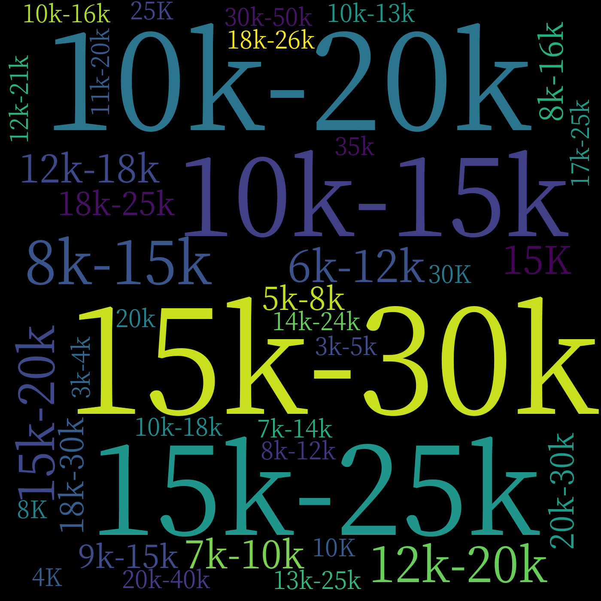
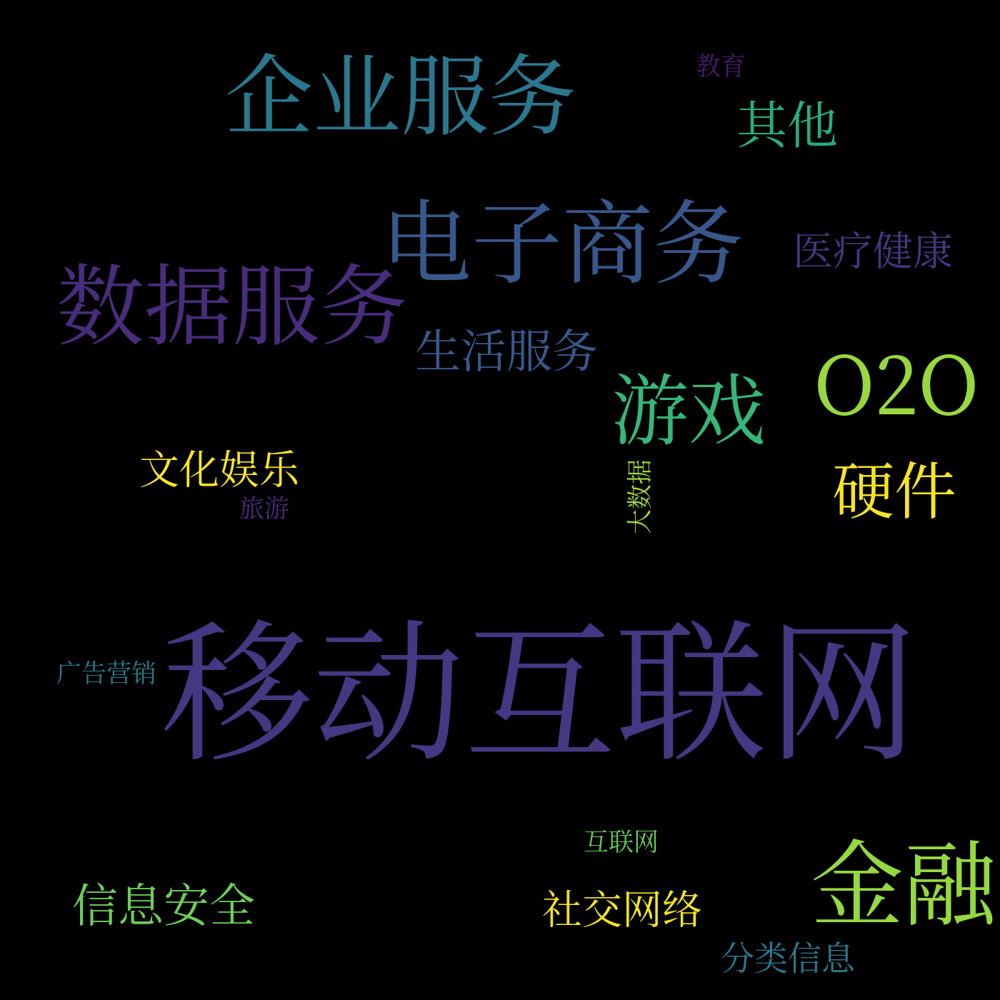

# lagou_wordcloud
从拉钩上获取某个计算机语言的的相关招聘信息，并生成各种词云图，代码只在Python3中测试过。

* Python技术栈词云图：

* Python工资词云图

* Python公司区域分布词云图

* Python行业词云图
 

* 其它职位的词云图见img_wordcloud文件夹。

# 使用
## 安装
* 1.安装Python3
* 2.安装词云图生成库：pip install wordcloud
* 3.安装结巴分词库：pip install jieba

## 运行
* 1.修改职位名称和需要查询的城市，运行get_position_brief_info.py抓取职位相关信息并保存到excel文件中。
  如爬取python，抓取到的招聘信息将保存在/xlsx_file/python_position_info.xlsx文件中，有了该文件才能生成词云图。

* 2.运行generate_wordcloud.py模块的函数可以生成词云图：
   * 运行generate_skill_wordcloud()函数，生成技术栈词云图；
   * 运行generate_salary_worlcloud()函数，生成工资词云图；
   * 运行generate_district_wordcloud()函数，生成公司区域分布词云图；
   * 运行generate_industry_field_wordcloud()函数，生成行业词云图；

* 3.statistics.py模块用于数值统计
   * calulate_average_salary()函数用于计算工资的平均最低限和平均最高限；
   
# 联系方式：
  * 博客：http://blog.csdn.net/xiemanr
  * 邮箱：xiemanrui@foxmail.com